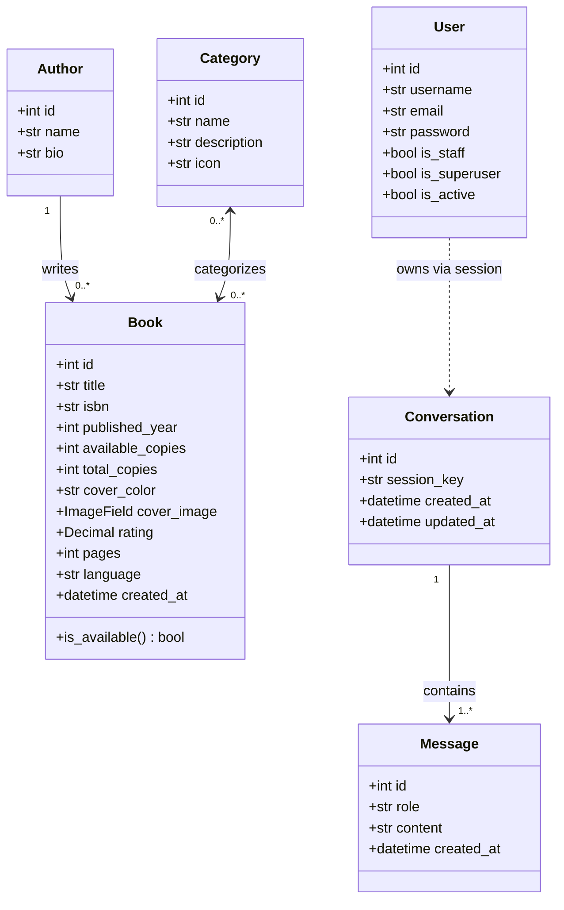
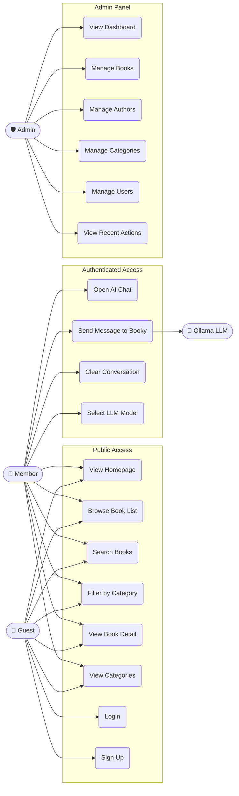
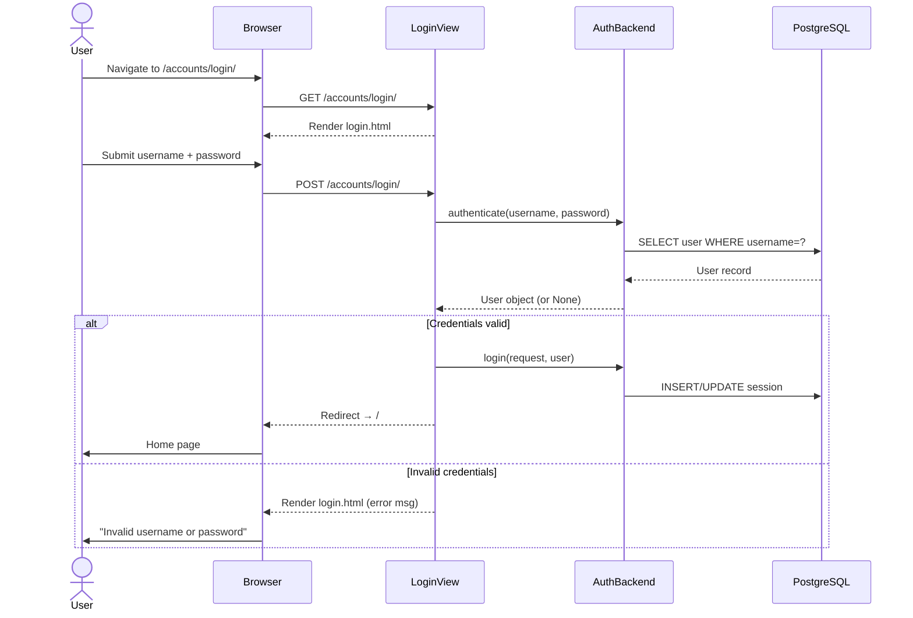
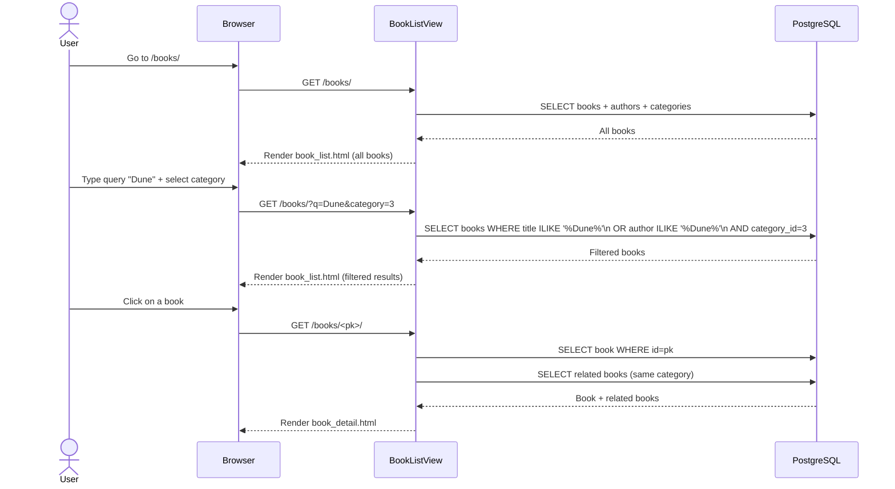
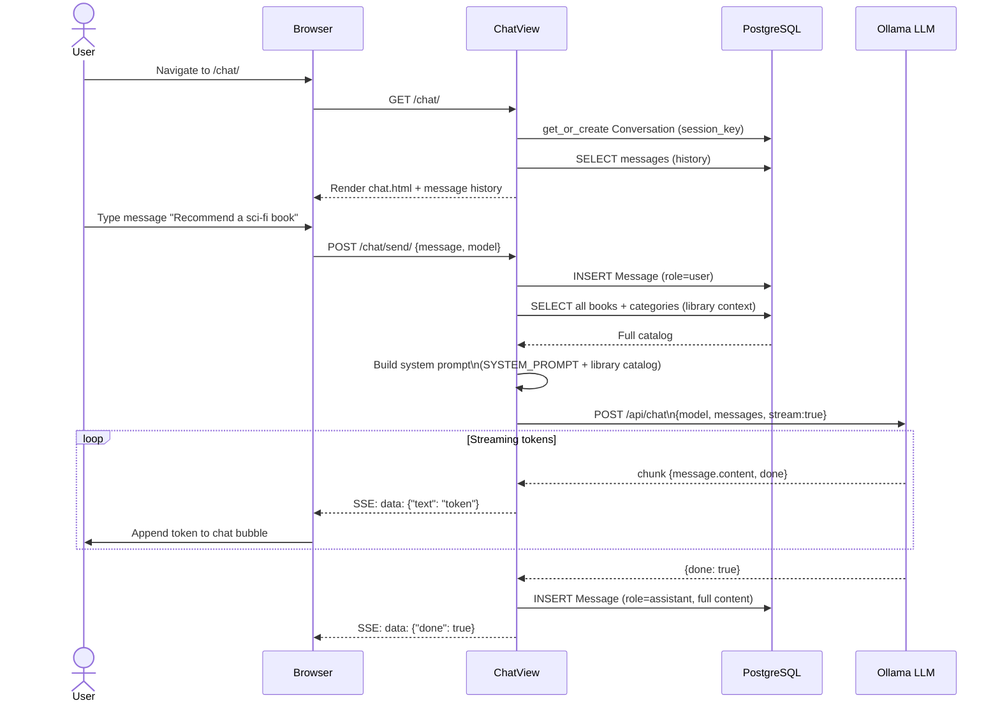
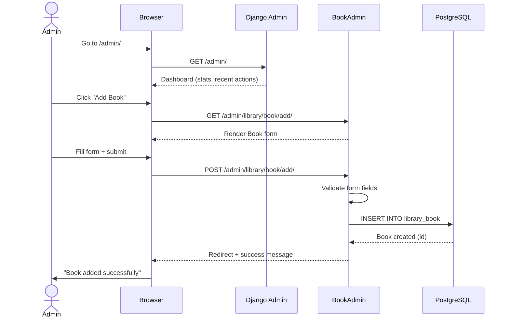

# Booky.tn — UML Diagrams

---

## 1. Class Diagram

---

## 2. Use Case Diagram

---

## 3. Sequence Diagrams

### 3.1 — User Login

---

### 3.2 — Book Search & Filter

---

### 3.3 — AI Chat with Booky

---

### 3.4 — Admin: Add a Book

